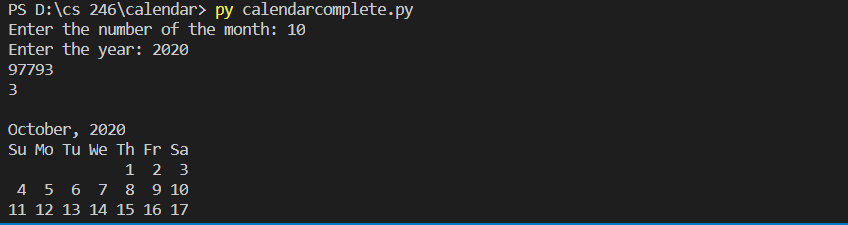

## Overview
This program allows the user to see a calendar of any month from the year 1753 to beyond. This demonstrates my ability to use functions and conditials, as well as taking input form users and the use of mathmatic expressions in python.

### Enviorment:
I used visual studio code with python and git downloaded

##### Running the Program:
I simpy inputed "calendar.py" into the terminal and it displaye the results.

##### Screenshot:

##### Helpful Websites: 
I found w3school.com to be extremely helpful, escpecially their pages on Functions and loops.
https://www.w3schools.com/python/python_functions.asp
https://www.w3schools.com/python/python_while_loops.asp
